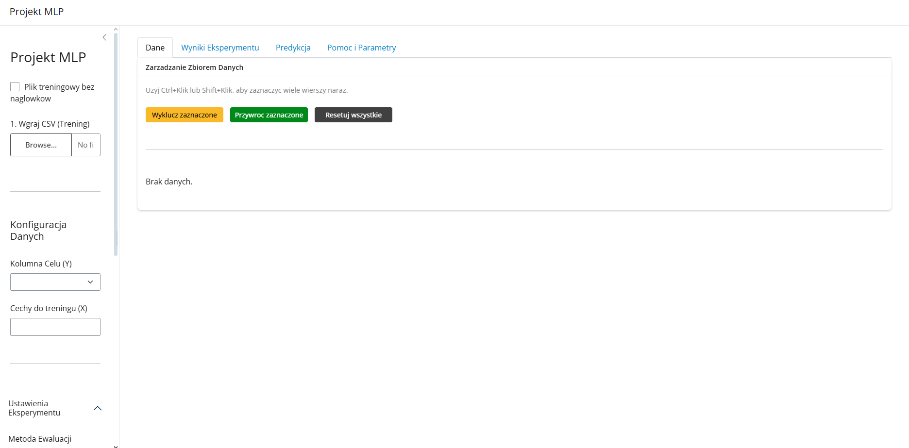
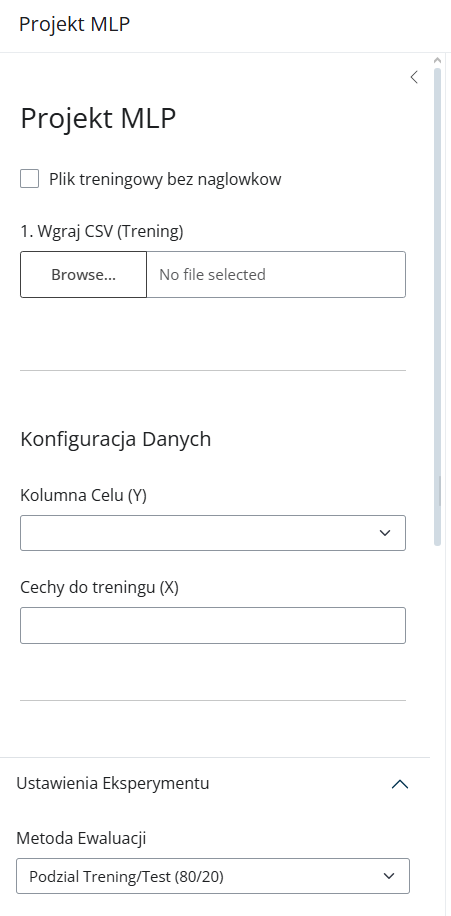
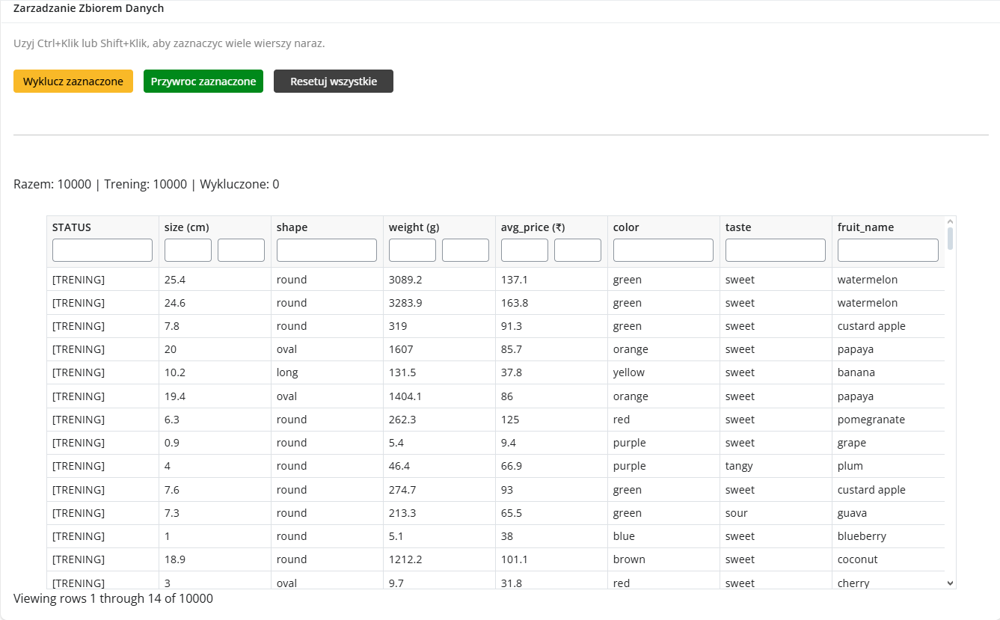
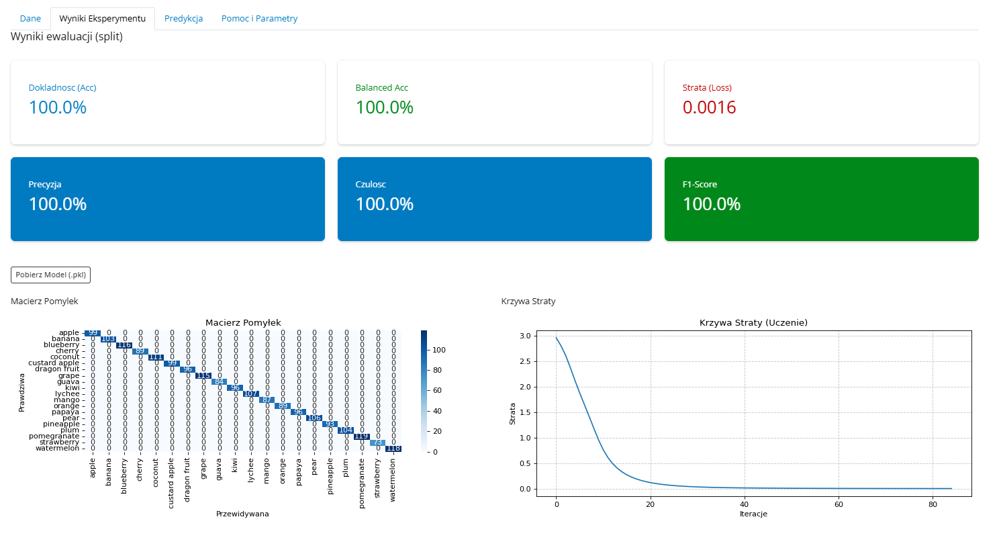
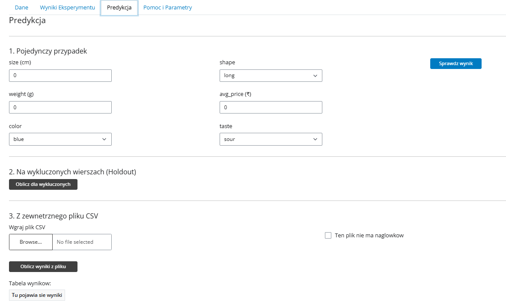

# Dokumentacja projektu  
## Aplikacja do trenowania i ewaluacji sieci neuronowej MLP

---

## 1. Wstęp

Celem projektu było stworzenie aplikacji umożliwiającej trenowanie, testowanie oraz ocenę jakości klasyfikatora opartego o **wielowarstwową sieć neuronową (MLP – Multi Layer Perceptron)**.  
Aplikacja została zaimplementowana w języku **Python** i posiada interfejs graficzny działający w przeglądarce.

Projekt umożliwia:
- wczytanie danych z pliku CSV,
- wybór kolumny decyzyjnej i cech wejściowych,
- konfigurację parametrów sieci neuronowej,
- wybór metody ewaluacji,
- analizę wyników za pomocą metryk i wykresów,
- wykonywanie predykcji na nowych danych,
- zapis wytrenowanego modelu do pliku.

---

## 2. Opis ogólny aplikacji

Aplikacja składa się z:
- panelu bocznego służącego do konfiguracji danych i modelu,
- czterech głównych zakładek:
  - **Dane**,
  - **Wyniki Eksperymentu**,
  - **Predykcja**,
  - **Pomoc i Parametry**.

Interfejs został wykonany z użyciem biblioteki **Shiny for Python**, co pozwala na interaktywną obsługę bez konieczności modyfikowania kodu źródłowego.

---

## 3. Interfejs użytkownika

### 3.1 Panel boczny – konfiguracja

Panel boczny umożliwia:
- wczytanie pliku CSV (z nagłówkami lub bez),
- wybór kolumny celu (Y),
- wybór cech wejściowych (X),
- konfigurację parametrów sieci neuronowej,
- wybór metody ewaluacji,
- uruchomienie procesu treningu.

Dostępne parametry:
- liczba warstw i neuronów,
- funkcja aktywacji,
- algorytm uczący (solver),
- liczba epok,
- parametr regularyzacji (alpha).

---

### 3.2 Zakładka „Dane”

Zakładka **Dane** służy do zarządzania zbiorem danych. Umożliwia:
- podgląd danych w formie tabeli,
- zaznaczanie i wykluczanie wybranych wierszy z treningu,
- przywracanie wykluczonych wierszy,
- sprawdzanie liczby danych treningowych i wykluczonych.

Każdy wiersz posiada status:
- `[TRENING]` – wiersz używany do uczenia modelu,
- `[WYKLUCZONY]` – wiersz pominięty w treningu.

---

### 3.3 Zakładka „Wyniki Eksperymentu”

Po zakończeniu treningu w tej zakładce wyświetlane są:
- wartości metryk jakości,
- macierz pomyłek,
- krzywa straty (jeśli dostępna),
- przycisk umożliwiający pobranie wytrenowanego modelu.

---

### 3.4 Zakładka „Predykcja”

Zakładka umożliwia wykonywanie predykcji w trzech trybach:
1. predykcja pojedynczego przypadku,
2. predykcja dla danych wykluczonych (holdout),
3. predykcja na podstawie zewnętrznego pliku CSV.

---

## 4. Przetwarzanie danych

Przed treningiem dane są automatycznie przetwarzane:
- usuwane są brakujące wartości,
- dane tekstowe są konwertowane na numeryczne (jeśli to możliwe),
- cechy numeryczne są standaryzowane (`StandardScaler`),
- cechy kategoryczne są kodowane liczbowo (`OrdinalEncoder`).

Proces ten realizowany jest za pomocą `ColumnTransformer`, co pozwala na jednoczesne przetwarzanie różnych typów danych.

---

## 5. Metody trenowania i ewaluacji

### 5.1 Podział trening/test (80/20)

Dane dzielone są na:
- 80% danych treningowych,
- 20% danych testowych.

Metoda jest szybka, jednak wynik zależy od losowego podziału danych.

---

### 5.2 Walidacja krzyżowa (k-Fold)

Dane dzielone są na `k` podzbiorów:
- model trenowany jest `k` razy,
- za każdym razem testowany na innym podzbiorze,
- wynik końcowy jest bardziej stabilny.

---

### 5.3 ShuffleSplit

Metoda polegająca na:
- wielokrotnych losowych podziałach danych,
- ocenie stabilności modelu przy różnych losowaniach.

---

### 5.4 Leave-One-Out (LOOCV)

Metoda, w której:
- dla `n` próbek model trenuje się `n` razy,
- każda próbka jest raz użyta jako zbiór testowy.

Metoda jest bardzo dokładna, ale czasochłonna.

---

## 6. Metryki oceny modelu

W projekcie wykorzystywane są następujące metryki:

- **Accuracy** – procent poprawnych predykcji,
- **Balanced Accuracy** – accuracy liczona osobno dla każdej klasy,
- **Precision** – dokładność pozytywnych predykcji,
- **Sensitivity (Recall)** – wykrywalność przypadków pozytywnych,
- **Specificity** – zdolność poprawnego odrzucania przypadków negatywnych,
- **F1-score** – kompromis pomiędzy precision i recall,
- **Loss** – wartość funkcji straty minimalizowanej podczas uczenia.

Metryki obliczane są w wersji **macro**, co oznacza równe traktowanie wszystkich klas.

---

## 7. Wizualizacja wyników

Aplikacja prezentuje wyniki w postaci:
- macierzy pomyłek,
- krzywej straty procesu uczenia,
- zestawu metryk liczbowych.

---

## 8. Predykcja

Dostępne są trzy tryby predykcji:
- pojedynczy przypadek (ręczne wprowadzanie danych),
- predykcja dla danych wykluczonych (holdout),
- predykcja z pliku CSV z możliwością pobrania wyników.

---

## 9. Wykorzystane biblioteki

W projekcie użyto następujących bibliotek:
- `pandas`,
- `numpy`,
- `scikit-learn`,
- `matplotlib`,
- `seaborn`,
- `joblib`,
- `shiny`.

---

## 10. Scenariusze użycia (instrukcja obsługi)

### Scenariusz 1 – Trening i ocena modelu

1. Uruchomić aplikację.
2. Wgrać plik CSV z danymi.
3. Wybrać kolumnę celu (Y).
4. Wybrać cechy wejściowe (X).
5. Ustawić parametry modelu.
6. Wybrać metodę ewaluacji.
7. Kliknąć **„Uruchom Eksperyment”**.
8. Odczytać wyniki w zakładce **Wyniki Eksperymentu**.

---

### Scenariusz 2 – Wykluczanie danych (holdout)

1. Przejść do zakładki **Dane**.
2. Zaznaczyć wybrane wiersze.
3. Kliknąć **„Wyklucz zaznaczone”**.
4. Wytrenować model.
5. W zakładce **Predykcja** obliczyć wyniki dla danych wykluczonych.

---

### Scenariusz 3 – Predykcja pojedynczego przypadku

1. Wytrenować model.
2. Przejść do zakładki **Predykcja**.
3. Uzupełnić wartości cech.
4. Kliknąć **„Sprawdź wynik”**.
5. Odczytać wynik klasyfikacji.

---

### Scenariusz 4 – Predykcja z pliku CSV

1. Wytrenować model.
2. Wgrać nowy plik CSV.
3. Kliknąć **„Oblicz wyniki z pliku”**.
4. Pobrać plik CSV z wynikami predykcji.

---

## 11. Zbiory danych użyte w testach

Podczas testowania aplikacji wykorzystano dwa publiczne zbiory danych:

- **Iris (Fisher’s Iris Dataset)**
  Źródło: https://archive.ics.uci.edu/dataset/53/iris

- **Fruits (Fruit Classification Dataset)**  
  Źródło: https://github.com/awal40/apa/blob/main/fruit_classification_dataset.csv

---

## 12. Podsumowanie

Projekt spełnia wymagania zaliczeniowe:
- wykorzystuje sieć neuronową MLP,
- oferuje różne metody ewaluacji,
- prezentuje wyniki w formie liczbowej i graficznej,
- posiada czytelny interfejs użytkownika.

Aplikacja stanowi praktyczne narzędzie do nauki i eksperymentów z uczeniem maszynowym.
